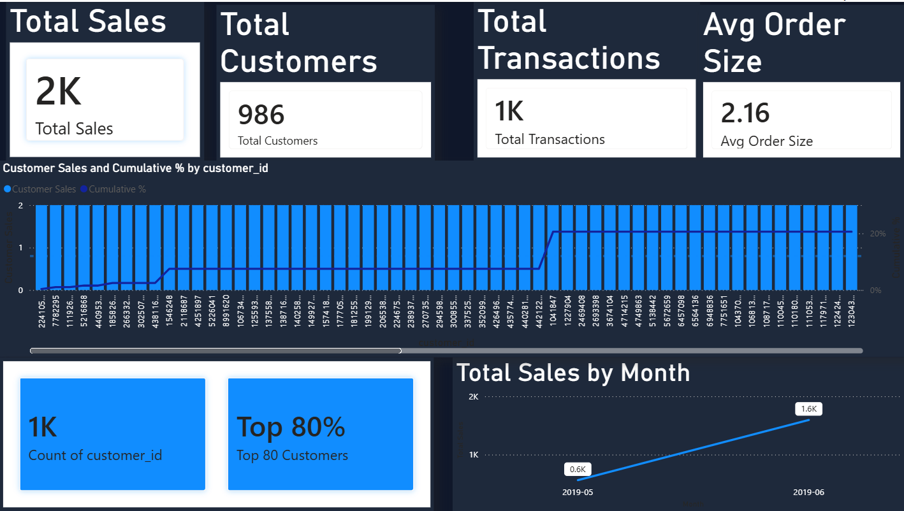

# 📊 E-Commerce Sales Dashboard (Power BI + SQL)

## 🔍 Project Overview
Built an interactive E-commerce Sales Dashboard using Power BI and SQL to analyze customer behavior, sales trends, and revenue contribution.

---

## 🎯 Business Objective
To convert raw transaction data into actionable insights for improving sales strategy and customer targeting.

---

## 🛠️ Tools & Technologies
- Power BI (Dashboard & Visualization)
- SQL (Data Analysis)
- DAX (KPIs & Pareto Analysis)
- Excel/CSV (Data Source)

---

## 📈 Key KPIs
- Total Sales
- Total Customers
- Total Transactions
- Average Order Value (AOV)

---

## 📊 Key Insights
- Top 20% customers contributed ~80% of total revenue (Pareto Analysis)
- Identified high-performing product categories
- Detected customer purchase patterns for better targeting

---

## 📸 Dashboard Preview

---

## 🚀 How to Use
1. Open `.pbix` file in Power BI Desktop
2. Load dataset if required
3. Explore interactive dashboard

---

## 📌 Project Status
✅ Completed
